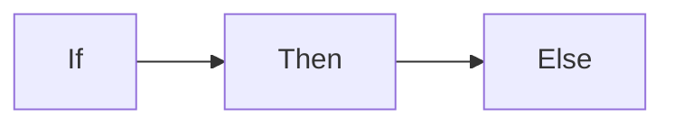

+++
title = 'Ess_dmsc_summer_school_day1'
date = 2023-09-05T22:09:28+02:00
menuTitle = "Topic A"
weight = 3
bookCollapseSection = false
bookHidden = false
draft = false
categories = ["taxonomy", "content"]
tags = "tutorial"
+++

# Hi day1



{}
An **information** disclaimer

You can add standard markdown syntax:

- multiple paragraphs
- bullet point lists
- _emphasized_, **bold** and even ***bold emphasized*** text
- [links](https://example.com)
- etc.

```plaintext
...and even source code
```

> the possibilities are endless (almost - including other shortcodes may or may not work)
{}