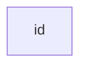
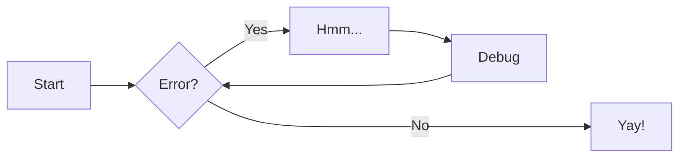
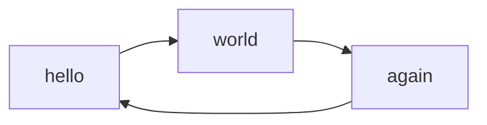

### Documentation
[Link](https://squidfunk.github.io/mkdocs-material/reference/diagrams/)

``` mermaid
flowchart LR
    id
```
 

``` mermaid
graph LR
  A[Start] --> B{Error?};
  B -->|Yes| C[Hmm...];
  C --> D[Debug];
  D --> B;
  B ---->|No| E[Yay!];
```
 

```mermaid
graph LR
    hello --> world
    world --> again
    again --> hello
```

...
